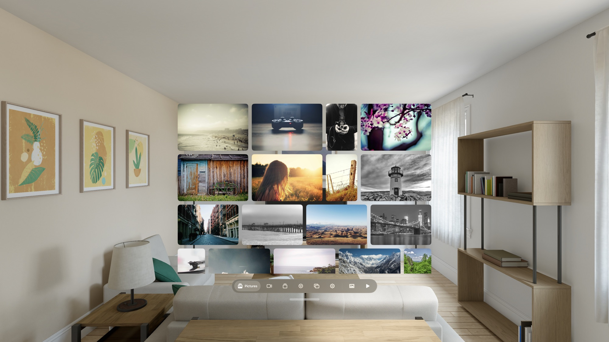
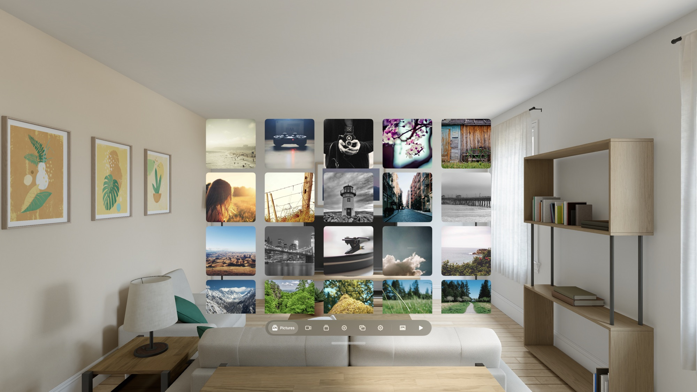
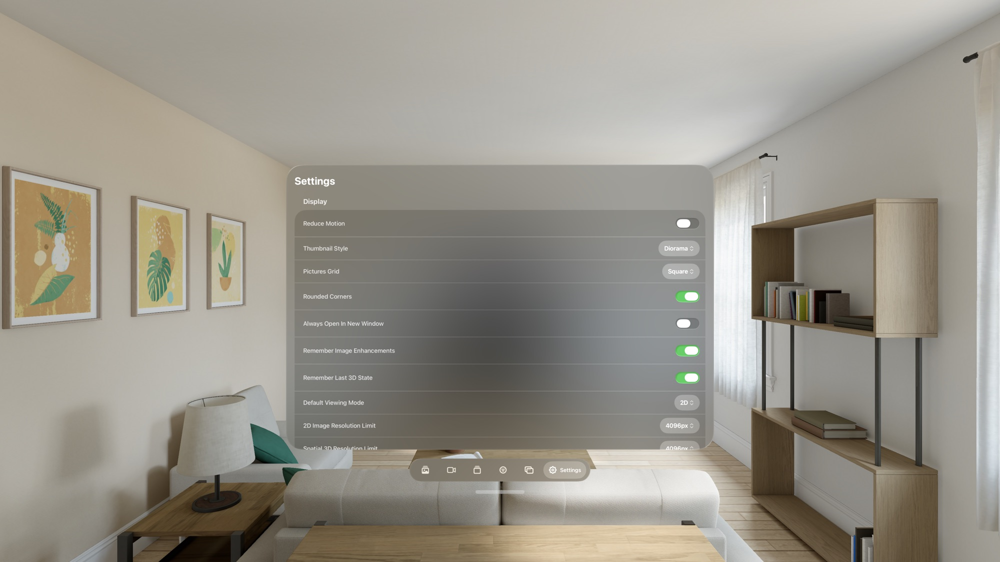
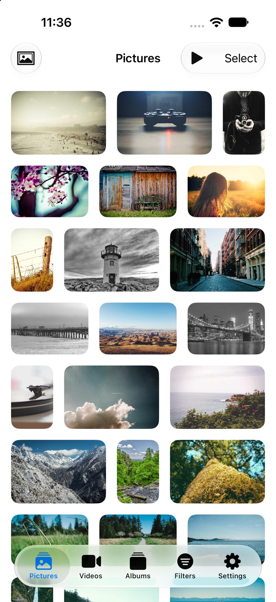
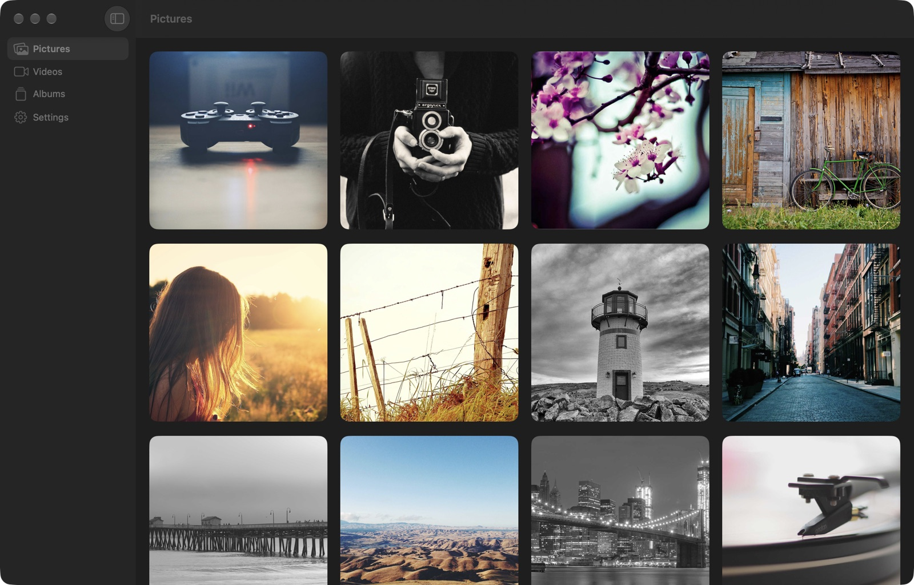
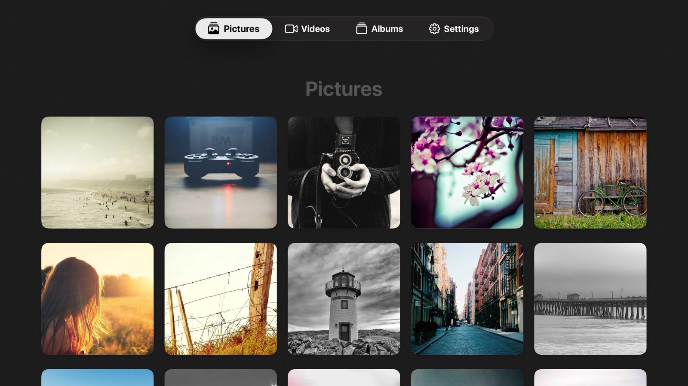

# Convolution

Convolution is a spatial media app for Apple Vision Pro, iPhone, iPad, Apple TV and Mac. It turns flat photos and videos into spatial 3D on the device, browses the libraries you already have, and plays films with their sound objects placed around you as real spatial sources.

It is one codebase with a single app target and platform-specific scene roots. The media pipeline — browsing, filters, slideshows, playback, adjustments, background removal, caches, settings backup — runs everywhere. What differs is the shell: visionOS gets multiple windows, ornaments and immersive 3D; macOS gets real multiple windows and a sidebar; tvOS gets a focus-driven TV root; iOS and iPadOS get a single-window shell. See [Platforms](#platforms).

> **Names.** *Convolution* is the shipping name. *Hypnos* is the internal codename and still appears in the Xcode project, scheme, folders, source types, the `com.illixion.hypnos` bundle identifier and the `hypnos://` URL scheme.

## Features

- **Spatial 2D → 3D photos** — RealityKit's `ImagePresentationComponent` converts ordinary images into spatial 3D photos, with a one-tap "Restore 3D" prompt for images you viewed in 3D before, an immersive mode, and diorama-style thumbnails
- **Four library sources** — your device **Photos** library (the default, no setup), **Local** files in the app's Documents folder, a **Stash** server, and a **Nextcloud** server. Switch between them from the tab bar
- **Library tab for Jellyfin** — an Apple-TV-app-style home (hero, shelves, detail pages, seasons and episodes) with watch progress synced both ways
- **Object-audio films** — with the companion Jellyfin plugin, a film's sound objects play as spatial sources in a virtual room around you, on the same clock as the picture. visionOS places them in space; Apple TV renders them through a head-tracked binaural stage; iOS and macOS use AirPods head tracking where available
- **Real-time and pre-processed 3D video** — convert a flat video to windowed stereoscopic 3D with Depth Anything V2, either instantly at up to 60 fps or by pre-processing the depth in the background and caching it; side-by-side and over-under sources convert to MV-HEVC for immersive playback
- **Pictures grid** — square cells or the original aspect ratio in justified rows, laid out from metadata alone so it settles before any pixel loads
- **Albums** — Photos albums, Stash galleries and Local folders through one browser
- **Photo viewer** — brightness, contrast, saturation and sharpening, auto-enhance, background removal, flip, and a pop-out into its own window
- **Slideshows** — Ken Burns motion, dynamic brightness, clock overlay, optional 3D layers, for anything you are browsing
- **Stash integration** — filters, saved presets, ratings, tags, performers, studios, metadata editing and multi-select delete, over the GraphQL API
- **Multiple windows** — visionOS and macOS open real separate windows; on visionOS a Windows tab lists every open one and can summon or close each
- **Pinned web pages and a RoboFrame viewer** — optional developer features
- **Set up Apple TV from another device** — send server settings and keys by scanning a QR code
- **Settings backup, cache manager and in-app console** — export and import settings, per-cache budgets and a log viewer

Nothing is uploaded: libraries are read on the device, and depth inference runs on the Neural Engine.

## Screenshots

The Apple Vision Pro shots are from the visionOS Simulator, with sample photos from [Picsum](https://picsum.photos) (Unsplash licence) in the Photos library.

**Pictures, original aspect ratio** — every image keeps its own shape, packed into rows that fill the window:



**Pictures, square cells** — the default grid, with the tab bar and slideshow button below it:



**Settings:**



### On other platforms

The same app on iPhone, Apple TV and Mac, each with its own shell around the shared pipeline (captured in the iOS and tvOS Simulators and a macOS debug build):

<table>
  <tr>
    <td width="26%"></td>
    <td width="74%"></td>
  </tr>
  <tr>
    <td align="center">iPhone</td>
    <td align="center">Mac</td>
  </tr>
</table>



## Requirements

- Apple Vision Pro or a visionOS Simulator for the full spatial experience
- iPhone, iPad, Apple TV or Mac, or the matching simulator
- Xcode 26+
- visionOS 26.0+, iOS 26.0+, tvOS 26.2+ or macOS 26.0+
- (Optional) a [Stash](https://github.com/stashapp/stash), Nextcloud or Jellyfin server

## Platforms

| Feature | visionOS | iOS / iPadOS | tvOS | macOS |
|---|---|---|---|---|
| Photos, Local, Stash and Nextcloud libraries; albums; filters; multi-select | ✓ | ✓ | ✓ | ✓ |
| Jellyfin Library tab | ✓ | ✓ | ✓ | ✓ |
| Photo viewer, adjustments, background removal, slideshows, share/info/edit | ✓ | ✓ | basic viewer | ✓ |
| Video playback, custom transport, A-B loop, transcode fallback | ✓ | ✓ | ✓ | ✓ |
| Object-audio film player | ✓ spatial sources | ✓ AirPods tracking | ✓ head-tracked binaural | ✓ AirPods tracking |
| Pinned web pages and `hypnos://play` handoff | ✓ | ✓ | — | ✓ |
| Settings backup export and import | ✓ | ✓ | — no Files app | ✓ |
| Cache manager and in-app debug console | ✓ | ✓ | ✓ | ✓ |
| Spatial 3D photo conversion and immersive 3D | ✓ | — needs a stereoscopic display | — | — |
| Pseudo-3D and MV-HEVC video with depth models | ✓ | — | — | ✓ |
| Multiple windows | ✓ | — single-window shell | — single-window shell | ✓ real windows and menu bar |
| Windows tab and saved window groups | ✓ | — | — | — |
| Set up from another device (QR code) | sends | sends | receives | sends |

Build from the command line for the platform you need:

```bash
# visionOS
xcodebuild -quiet -project Hypnos/Hypnos.xcodeproj -scheme Hypnos \
  -destination 'generic/platform=visionOS' build CODE_SIGNING_ALLOWED=NO

# iOS / iPadOS
xcodebuild -quiet -project Hypnos/Hypnos.xcodeproj -scheme Hypnos \
  -destination 'generic/platform=iOS Simulator' build CODE_SIGNING_ALLOWED=NO

# tvOS
xcodebuild -project Hypnos/Hypnos.xcodeproj -target Hypnos -sdk appletvos \
  SDKROOT=appletvos SUPPORTED_PLATFORMS='appletvos appletvsimulator' \
  TARGETED_DEVICE_FAMILY=3 TVOS_DEPLOYMENT_TARGET=26.2 CODE_SIGNING_ALLOWED=NO \
  SYMROOT=<scratch dir> build

# macOS
xcodebuild -quiet -project Hypnos/Hypnos.xcodeproj -scheme Hypnos \
  -destination 'generic/platform=macOS' build CODE_SIGNING_ALLOWED=NO
```

## Dependencies

Convolution links three shared sibling packages and one package of its own:

| Package | Products used |
|---|---|
| [`RAVESDK`](https://github.com/illixion/RAVESDK) | `RAVENet`, `RAVEUI`, `RAVEConsole`, `RAVEMedia`, `RAVESlideshow`, `RAVEFilm`, `RAVEDeviceSetup` |
| [`RAVEEngine`](https://github.com/illixion/RAVEEngine) | `RAVEDiagnostics` |
| [`DebugTrace`](https://github.com/illixion/DebugTrace) | `DebugTrace`, `DebugTraceServer` |
| `Packages/NextcloudMedia` (in this repo) | `NextcloudMedia` |

The three sibling packages are referenced as **local** Swift packages by relative
path — `../../RAVESDK`, `../../RAVEEngine` and `../../DebugTrace`, resolved against
the directory holding `Hypnos.xcodeproj` — not as versioned remote dependencies. So
a clone does not fetch them: check them out as **siblings** of this repo, which is
what step 1 below does.

The requirement is only that this repo's parent directory also contains
directories named exactly `RAVESDK`, `RAVEEngine` and `DebugTrace`; this repo's own
directory name does not matter. Get it wrong and Xcode fails at package resolution,
before compiling anything.

Why path references and not versions: the packages and the apps co-evolve
continuously — several of these targets arrived in the packages by being lifted
out of this app — and a path reference keeps "move this into the package and
update its callers" a single atomic edit.

## Installation

### iPhone and iPad: AltStore or SideStore

Add the source `https://apps.illixion.com/source.json` to [AltStore](https://altstore.io) or [SideStore](https://sidestore.io), or open [apps.illixion.com](https://apps.illixion.com) on the device and tap its button, then install Convolution. It updates from there with every release. The same file is attached to every release as `Convolution-iOS-unsigned.ipa`, and [this link](https://github.com/illixion/Convolution/releases/latest/download/Convolution-iOS-unsigned.ipa) always serves the newest one.

- **Made for iPhone and iPad.** Neither store supports Apple TV or Mac, and neither officially supports Vision Pro (see below).
- **Your Apple ID signs it.** On a free Apple ID an app expires after 7 days unless AltStore or SideStore refreshes it in time, and only three sideloaded apps can be active at once, the store itself included.
- **It's the iOS / iPadOS column of [Platforms](#platforms):** no spatial 3D photo conversion, depth-model video or multiple windows.
- iOS 26.0 or later.

### Vision Pro

Neither store officially supports it, but a community port does: [iloader's Vision Pro pull request](https://github.com/nab138/iloader/pull/565) pairs with the headset over Wi-Fi with the code from Settings → General → Remote Devices, the same pairing Xcode uses, and installs a patched SideStore. It needs no Developer Strap. It is unmerged, and untested with this source. Otherwise, every [release](../../releases) carries an unsigned visionOS IPA, `Convolution-visionOS-unsigned.ipa` ([newest](https://github.com/illixion/Convolution/releases/latest/download/Convolution-visionOS-unsigned.ipa)): sign it with your own Apple ID, or build from source below.

### Apple TV and Mac

No prebuilt download yet; build from source below. An Apple TV build signed with a free Apple ID expires after 7 days, and nothing refreshes it for you.

### From source (every platform)

1. Clone this repository and the three packages into the same parent directory:
   ```bash
   git clone https://github.com/illixion/Convolution.git
   git clone https://github.com/illixion/RAVESDK.git
   git clone https://github.com/illixion/RAVEEngine.git
   git clone https://github.com/illixion/DebugTrace.git
   ```
   giving you:
   ```
   some-parent/
   ├── RAVESDK/
   ├── RAVEEngine/
   ├── DebugTrace/
   └── Convolution/
   ```

2. Open the project in Xcode:
   ```bash
   cd Convolution
   open Hypnos/Hypnos.xcodeproj
   ```

3. Select your development team in Xcode (Project → Signing & Capabilities)

4. Pick a visionOS, iOS, tvOS or macOS run destination and build and run (Cmd+R)

## Configuration

On first launch a short welcome flow introduces the app and lets you pick sources. With no setup, the app browses your device **Photos** library and any files in its **Local** folder.

### Photos and Local files
The Photos library needs no configuration beyond granting access. For **Local** files, put images in the app's `Documents/Photos/` folder and videos in `Documents/Videos/` — in the Files app that is **On My Apple Vision Pro / iPhone / iPad / Mac → Convolution**. Local is always available alongside Photos.

### Stash server
1. Open **Settings** → **Media Server**
2. Enter your Stash server URL (for example `http://192.168.1.100:9999`)
3. Enter your API key if authentication is enabled
4. Choose **Apply & Test Connection**

Once a server is set, the tab bar's library switch on Pictures and Videos offers Stash too. **Server-Side Transcoding** keeps Stash's HLS transcode in reserve for files the device cannot decode.

### Nextcloud
Under **Settings** → **Nextcloud**, enter the server URL and choose **Sign In**. Signing in opens your server's own login page, so Convolution never sees your password; the access it receives is listed under Settings → Security on the server, where you can revoke it. Pick a **Library Folder** to scope what is browsed.

### Jellyfin and object audio
Under **Settings** → **Jellyfin Server**, enter the server (for example `https://host/jellyfin`) and sign in with a user, or paste an API key. The key is enough to browse, but watch-progress sync needs a signed-in user. This powers the **Library** tab.

For a film's object audio, install the companion plugin on the Jellyfin server — see [`JellyfinPlugin/README.md`](JellyfinPlugin/README.md). Without it, films play through the Library's ordinary player.

## Usage

### Pictures tab
Browse your photos in a grid (square or original aspect ratio, set in Settings → Display → **Pictures Grid**). Tap an image to open it in the viewer:
- **Swipe** left/right to move between images
- The **2D/3D** menu generates a spatial 3D version, switches to immersive 3D, or returns to 2D
- The **Adjustments** button opens brightness, contrast, saturation, sharpen, opacity, auto-enhance, background removal and flip in one place
- The **Info** button shows metadata, and for Stash, ratings, tags and editing
- The **Slideshow** button starts a slideshow of what you are viewing
- The **pop-out** button opens the image in its own window
- Images you viewed in 3D before show a "Restore 3D" pill that opts back in with one tap (it dismisses itself after 10 seconds)

Spatial 3D generation needs an Apple Vision Pro; the Simulator falls back to the flat photo.

### Videos tab
Browse and play videos. The **view mode** button in the ornament switches between flat **2D**, **Convert to 3D (Beta)** and, for side-by-side or over-under sources, full immersive **Stereoscopic 3D**.

#### Converting flat video to 3D
Windowed stereoscopic 3D from any flat video, using Core ML monocular depth (Depth Anything V2 Small):
- **Real-Time** — instant, with depth inferred at about 30 Hz and held for the in-between frame
- **Pre-Process** — converts in the background and caches the depth in a compact HEVC sidecar. The video keeps playing in 2D meanwhile and switches to 3D automatically once enough depth is ready. Later plays read the cache at full frame rate with no Neural Engine load
- The first time you convert, a setup sheet offers a depth model to download from Apple's Hugging Face repo (about 19–50 MB, in four precision variants). Choose which installed model each pipeline uses under Settings → Display, or from the view-mode menu
- **Convergence** — which depth sits on the window plane — is adjusted in the Adjustments window, which opens as its own repositionable window so it never sits behind the 3D video. Depth strength is fixed
- **Real-Time 3D for All Videos** (Settings → Display) opens eligible videos in 3D automatically, preferring cached depth when it exists

#### Stereoscopic 3D
Videos tagged side-by-side or over-under in Stash convert to MV-HEVC and play in a full immersive space.

#### Playback
Custom controls (play/pause, scrubber with buffered range, ±10 s, A-B loop, mute) share one ornament in 2D and 3D, so all chrome stays on the video's depth plane. Window aspect ratio is locked to the video.

### Albums tab
Photos albums and smart albums, Stash galleries (and groups for video) and Local folders. Opening one applies it as a filter on Pictures or Videos, with a banner to get back; Local folders are browsed as a tree.

### Library tab
The Jellyfin home: a hero, shelves, detail pages with seasons and episodes, search, and resume. Films with object audio play in the film player; everything else uses the generic player. Progress is written back to the server.

### Filters tab
Filter Stash content by title, galleries, performers, studios and tags, by rating or activity count, and sort by date, title, rating or random. Save combinations as presets or default views. Hidden when browsing Local files, which have nothing to filter by.

### Windows tab
visionOS only. Lists every open window with **Summon** and **Close**, plus Hide All and Close All. Summon recreates the window where you are, which also recovers windows left behind in other rooms. macOS uses its own sidebar, menu bar and Window menu instead.

### Settings tab
Display and viewer options, slideshow defaults, the Photos, Local, Stash, Nextcloud and Jellyfin sections, window groups (visionOS), cache manager (presets and per-cache usage), backup export and import (not on Apple TV), and a Developer section: depth model manager, converted-video cache, RoboFrame viewer, debug console and diagnostics.

### URL handoff
The app registers a `hypnos://` URL scheme. `hypnos://play?url=<link>` plays a direct video link (MP4 or HLS) in a new window, `hypnos://image?id=<id>` opens a Stash image, and `hypnos://setup` carries settings from another device.

## RoboFrame viewer (Developer)
A slideshow viewer for a [RoboFrame](https://github.com/illixion/RoboFrame) proxy, with WebSocket control, multi-device sync and Home Assistant sensor overlays. Enable it in Settings → Developer → **Enable RoboFrame Viewer**, which adds a Remote tab with saved profiles. Profiles can also pin an ordinary web page as a panel in your space.

## Architecture

The app follows a SwiftUI architecture:
- `AppModel` — central `@Observable` state container
- `PhotoWindowModel` and `VideoWindowModel` — per-window `@Observable` models, split into extensions by concern; side-effect-free `init`, side effects in `start()`
- Protocol-based sources (`ImageSource`, `VideoSource`) behind a `LibrarySource` choice of Photos, Stash, Local or Nextcloud; a server-agnostic `MediaServerLibrary` for Jellyfin
- `PhotoDisplayView` + `PhotoOrnamentView` — shared by all photo viewer windows
- RealityKit `ImagePresentationComponent` for spatial photos; a Metal path (`MetalImageView`) for everything else
- `Pseudo3DVideoPlayerView` + `StereoPump` + `CoreMLDepthProvider` (in `RAVEMedia`) for real-time windowed 2D→3D video, with all per-frame GPU work off the main thread
- `DepthConverter`, `DepthCacheStore` and `DepthCacheReader` for the pre-processed pipeline, and `DepthConversionManager` for background jobs with progressive playback
- `FilmPlayerView` on `RAVEFilm` for object-audio films
- `StereoscopicVideoPlayer` + `MVHEVCConverter` for MV-HEVC immersive video
- `SlideshowEngine` (in `RAVESlideshow`) and `RemoteViewerModel` for slideshows

Platform notes live in [`CLAUDE.md`](CLAUDE.md) and `.claude/rules/`.

## License

See [LICENSE.txt](LICENSE.txt) for licensing information, and
[THIRD_PARTY_NOTICES.md](THIRD_PARTY_NOTICES.md) for third-party components
used by the app and the Jellyfin plugin (Cavern, truehdd, Depth Anything V2).

## Acknowledgments

- [Stash](https://github.com/stashapp/stash) — self-hosted media organizer
- Built with Apple's RealityKit, Core ML and SwiftUI frameworks
